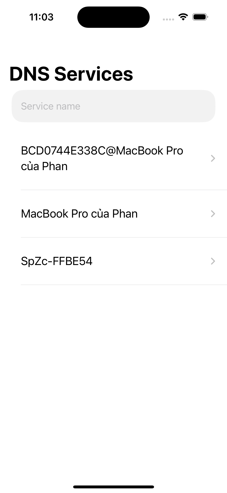
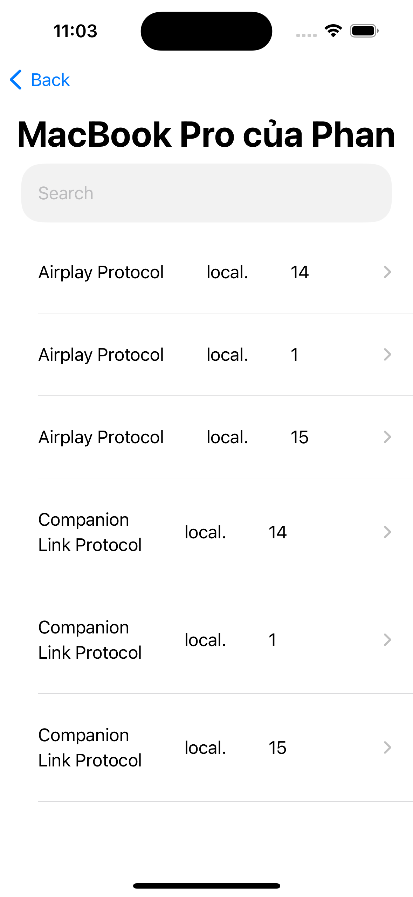
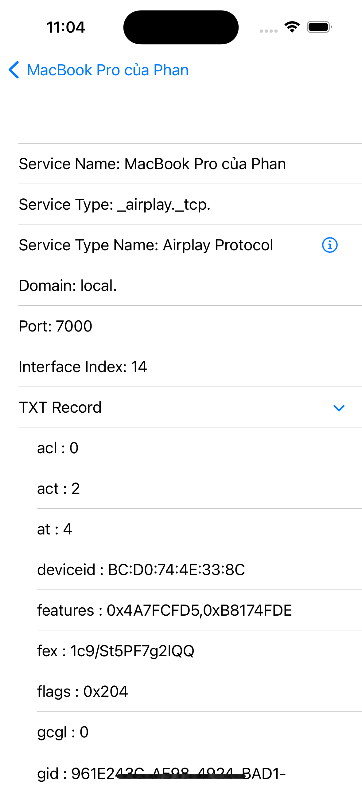
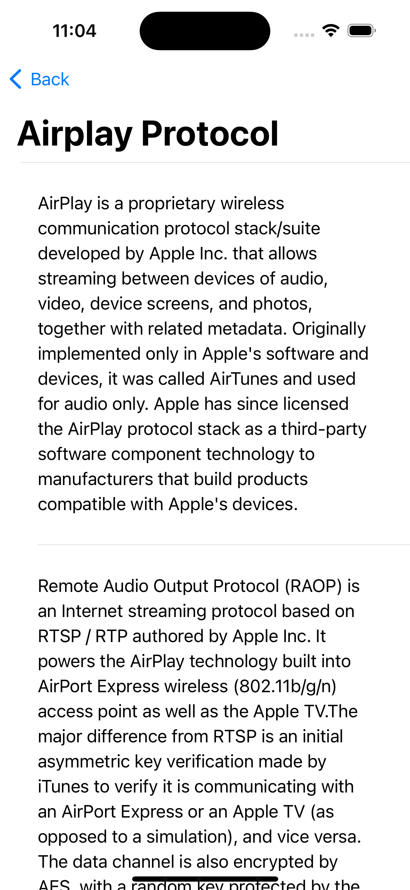

# DiscoverDNSServices
This app support to Discover DNS Services in your local wifi. And then support to search something about what DNS service such as: what protocol, what manufactor, etc by Wikipedia API.
This project is the showcase of MVVM architecture, following SOLID principles, SwiftUI, SwiftCombine, etc.

   

# Features 
- Listing DNS service by Device name
- Listing DNS services of device
- Filterig DNS service by key search
- Get full information of DNS service
- Searching and representing Wikipedia of DNS service such as protocol, manufactor
> [!NOTE]
> List supporting DNS Services so far:
>
    _services._dns-sd._udp 
    _airplay._tcp
    _home-sharing._tcp
    _raop._tcp
    _sftp-ssh._tcp
    _ssh._tcp
    _smb._tcp
    _printer._tcp
    _companion-link._tcp
    _spotify-connect._tcp
    _pdl-datastream._tcp
    
- Unit-Test: 
    + Dashboard:
        + DashboardViewmodel
        + DashboardModel

# Backlogs
- Others:
    + Retouch UI 
    
# Techniques
- SwiftUI: to develop User Interfaces
- SwiftCombine: to bind data
- Grand central Dispatch (GCD): to multithread 
- MVVM architecture: develop application
- Quick, Nimble framework: to write UnitTest
- Follow SOLID principles
- Swift DNS Service Discovery framework: to discover DNS services
- WikipediaKit: To search and get information with key search

## Environment
- XCode 15.0 ++
- iOS 17 ++

## How to run
To run/ compile the app, we need to install some libraries from Swift Packages Manager:
- Swift DNS Service Discovery [Github page](https://github.com/fwcd/swift-dns-service-discovery)
- WikipediaKit [Github page](https://github.com/Raureif/WikipediaKit)
 
To run Unit-test, we need to install some libraries from Swift Packages Manager:
- Quick
- Nimble
